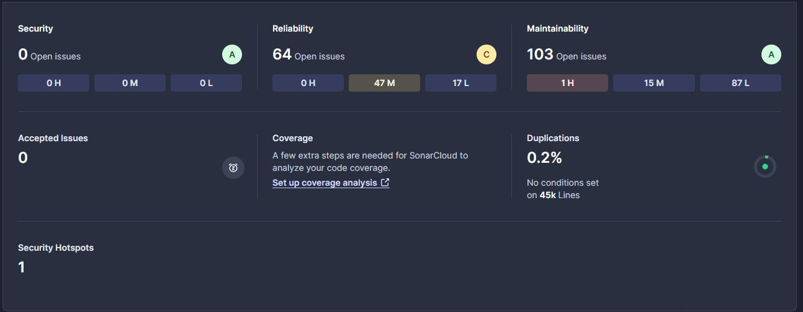
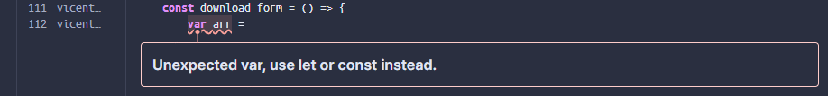

Analisis inicial por parte de Sonarcloud.io

Se identifican los siguientes problemas (issues) destacados:

1 de Alta Severidad (High Severity) en Mantenibilidad (Maintainability).
47 de Mediata severidad (Medium Severity) en Fiabilidad (Reliability).

**Mantenibilidad**

SonarCloud identifica un uso de var y recomienda usar let o const, dado que el valor de arr varía dependiendo de la solicitud.

Se implementará la recomendación, haciendo uso de let ya que el valor de arr varía dependiendo de la solicitud. De tal forma evitamos problemas a futuro por el ámbito global de var.

Existen otros problemas de Severidad menor, siendo frecuentes los de “remoción de código comentado” y “remoción de asignaciones inútiles”.
Estos problemas se decide omitir implementar las recomendaciones ya que el código comentado es de utilidad por si se quiere debugear alguna función, ya que parte del código comentado son funciones de log que muestra por consola los inputs y outputs de las funciones.

Por otro lado, la “remoción de asignaciones inútiles” hace referencia a funciones o funcionalidades que no están siendo usadas, al ser parte de código legacy, su remoción puede llevar a un código inestable o que directamente no funcione, por lo que tampoco se considerara implementar las recomendaciones.

**Fiabilidad**

Se identifican problemas de severidad media, siendo principalmente por no seguir estándares de React.

Y, también otro problema de severidad media que corresponde a la accesibilidad de un titulo de la página.

