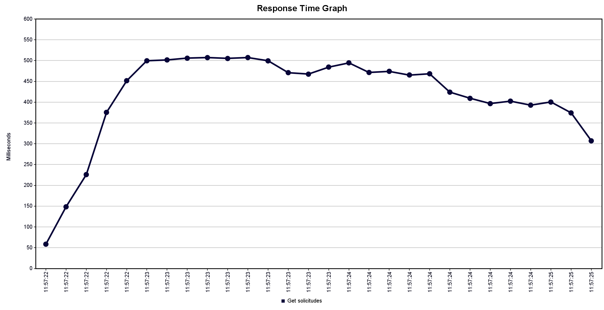

Para este escenario, se aumenta tanto la cantidad de usuarios (100) como el response time máximo esperado (500), en comparación con la situación ideal. Realizando estos cambios, se observa que, en un comienzo, aumenta el tiempo de respuesta casi un cuádruple de lo inicial, hasta el punto de llegar al response time máximo esperado, en donde se mantiene este limite ya que las solicitudes fueron rechazadas (sobrepasaron el limite).

Se observa un aumento rapido al inicio de las solicitudes ya que el servidor recibe tantas solicitudes como es capaz de soportar, por lo que una vez recibe las solicitudes, no es capaz de resolverla y sobrepasa el tiempo de respuesta esperado.
