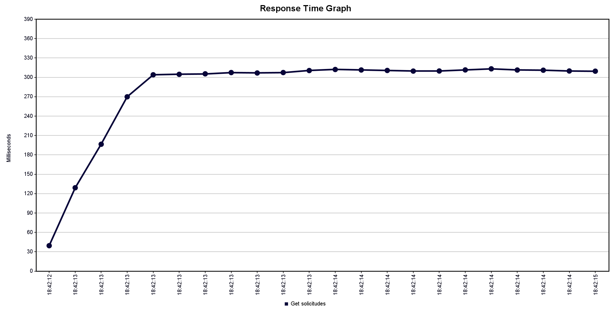

Para este escenario, se aumenta tanto la cantidad de usuarios (100) como el response time máximo esperado (300), en comparación con la situación ideal. Realizando estos cambios, se observa que, en un comienzo, aumenta el tiempo de respuesta casi un cuádruple de lo inicial, hasta el punto de llegar al response time máximo esperado, en donde se mantiene bordeando este número para el resto de las solicitudes (la mayoría).
