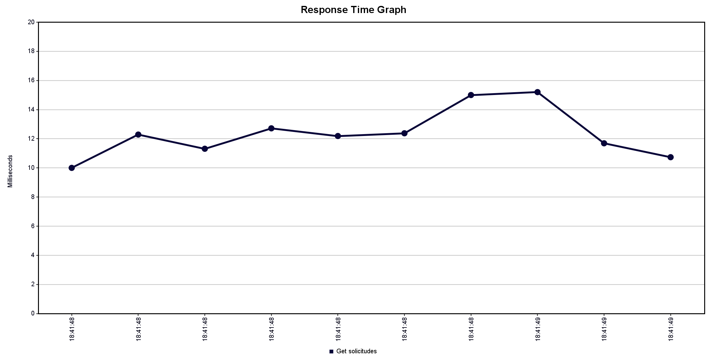

En este gráfico, se observa el tiempo de respuesta en milisegundos para las solicitudes, realizando una situación para 30 usuarios recurrentes y un máximo de 100 milisegundos de response time, tiempo que corresponde al máximo esperado.

Para esta situación, el tiempo de respuesta bordea los 12 milisegundos para las solicitudes recurrentes, y se utilizará como "situación ideal".
