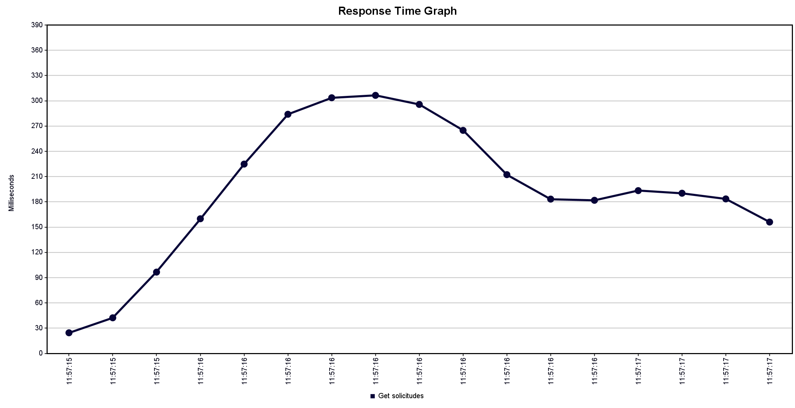

Se grafica una situación para 50 usuarios recurrentes y un response time de 300 milisegundos como máximo esperado.

Comparando con un escenario similar pero con 30 usuarios, se observa que, al aumentar este número a 50, comienza de manera rápida partiendo con un rango de 20-80 milisegundos para las primeras solicitudes y, a medida que estas aparecen, el tiempo de respuesta aumenta y bordea el máximo permitido, incluso llegando a superarlo y mantenerse constante en el límite, es decir, todas las solicitudes que llegan al borde, fueron rechazadas al sobrepasar el limite de tiempo de respuesta de 300 ms esperado.
