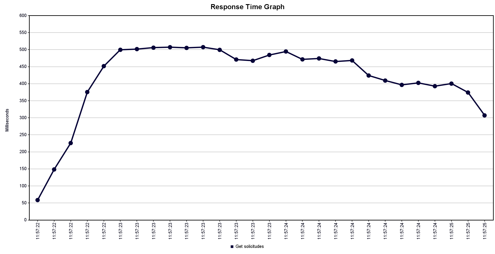
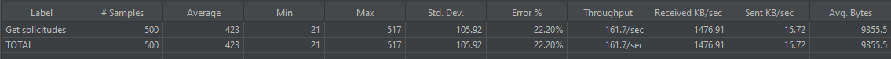

Al analizar el grafico del Tiempo de respuesta en milisegundos vs Solicitudes para 100 usuarios con un tope de 500 milisegundos maximo esperado, se ve que en el caso inicial se van cancelando las Solicitudes que sobrepasan el limite, y despues cuando ya se van terminando las Solicitudes, se ve una baja en el tiempo de respuesta.

Al analizar el summary se ve un 22,2% de error, esto se puede inferir que se debe a la mayor cantidad de usuarios.

